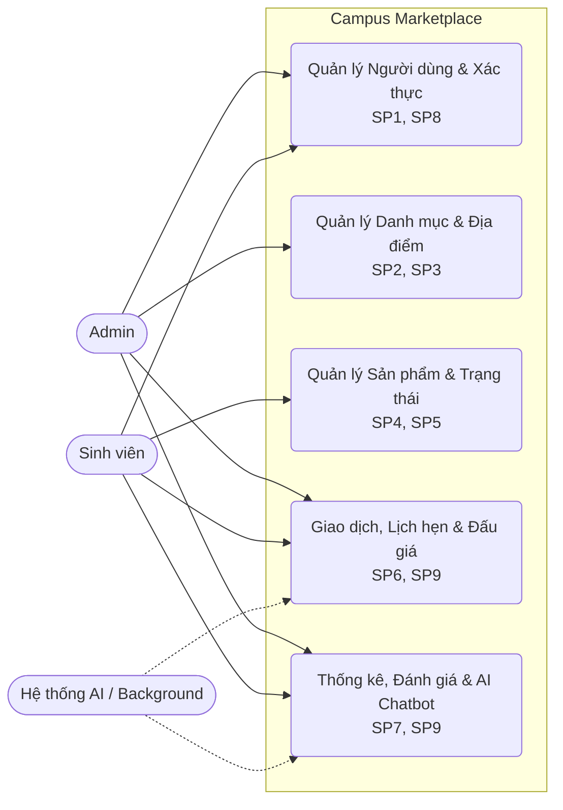
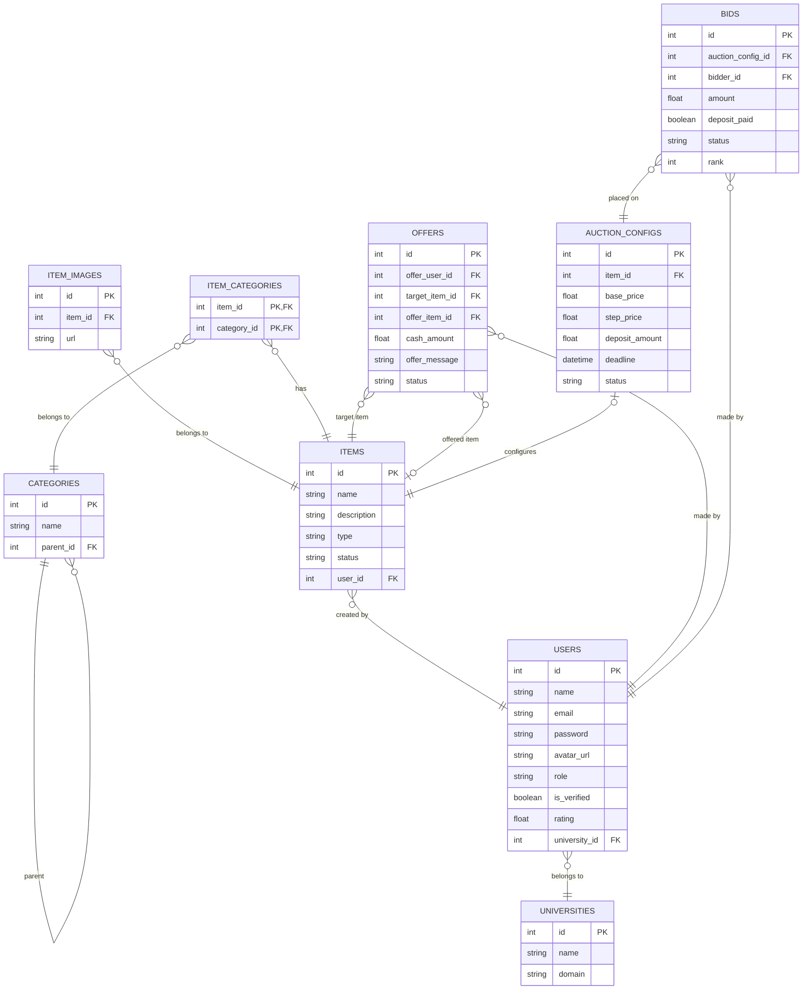

# Tổng thể hệ thống Campus Marketplace

## Biểu đồ Use Case Tổng Thể (Overall Use Case Diagram)

```mermaid
flowchart LR
    Admin([Admin])
    Student([Sinh viên])
    System([Hệ thống AI / Background])
    
    subgraph Campus Marketplace
        UCM(Quản lý Người dùng & Xác thực\nSP1, SP8)
        LCM(Quản lý Danh mục & Địa điểm\nSP2, SP3)
        PM(Quản lý Sản phẩm & Trạng thái\nSP4, SP5)
        TM(Giao dịch, Lịch hẹn & Đấu giá\nSP6, SP9)
        SM(Thống kê, Đánh giá & AI Chatbot\nSP7, SP9)
    end
    
    Admin --> UCM
    Admin --> LCM
    Admin --> SM
    Admin --> TM
    
    Student --> UCM
    Student --> PM
    Student --> TM
    Student --> SM
    
    System -.-> SM
    System -.-> TM
```

## Lược đồ Cơ sở dữ liệu Tổng Thể (Overall ERD)

```mermaid
erDiagram
    UNIVERSITIES {
        int id PK
        string name
        string domain
    }

    USERS {
        int id PK
        string name
        string email
        string password
        string avatar_url
        string role
        boolean is_verified
        float rating
        int university_id FK
    }

    CATEGORIES {
        int id PK
        string name
        int parent_id FK
    }

    ITEMS {
        int id PK
        string name
        string description
        string type
        string status
        int user_id FK
    }

    ITEM_IMAGES {
        int id PK
        int item_id FK
        string url
    }

    ITEM_CATEGORIES {
        int item_id PK, FK
        int category_id PK, FK
    }

    OFFERS {
        int id PK
        int offer_user_id FK
        int target_item_id FK
        int offer_item_id FK
        float cash_amount
        string offer_message
        string status
    }

    AUCTION_CONFIGS {
        int id PK
        int item_id FK
        float base_price
        float step_price
        float deposit_amount
        datetime deadline
        string status
    }

    BIDS {
        int id PK
        int auction_config_id FK
        int bidder_id FK
        float amount
        boolean deposit_paid
        string status
        int rank
    }

    %% Relationships
    USERS }o--|| UNIVERSITIES : "belongs to"
    ITEMS }o--|| USERS : "created by"
    ITEM_IMAGES }o--|| ITEMS : "belongs to"
    
    ITEM_CATEGORIES }o--|| ITEMS : "has"
    ITEM_CATEGORIES }o--|| CATEGORIES : "belongs to"
    CATEGORIES ||--o{ CATEGORIES : "parent"

    OFFERS }o--|| USERS : "made by"
    OFFERS }o--|| ITEMS : "target item"
    OFFERS }o--o| ITEMS : "offered item"

    AUCTION_CONFIGS |o--|| ITEMS : "configures"
    BIDS }o--|| AUCTION_CONFIGS : "placed on"
    BIDS }o--|| USERS : "made by"
```
