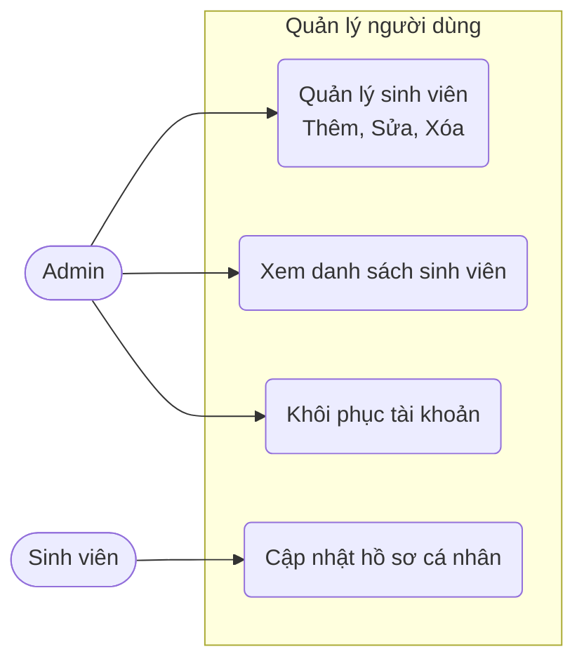
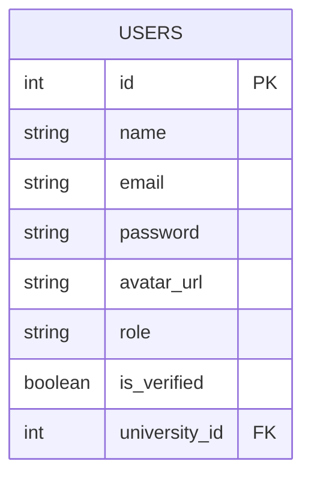

# Sprint 1: User Management

## Biểu đồ Use Case

```mermaid
flowchart LR
    Admin([Admin])
    Student([Sinh viên])
    
    subgraph SP1 [Quản lý người dùng]
        UC1(Quản lý sinh viên\nThêm, Sửa, Xóa)
        UC2(Xem danh sách sinh viên)
        UC3(Cập nhật hồ sơ cá nhân)
        UC4(Khôi phục tài khoản)
    end
    
    Admin --> UC1
    Admin --> UC2
    Admin --> UC4
    Student --> UC3
```

## Biểu đồ Cơ sở dữ liệu (ERD)

```mermaid
erDiagram
    USERS {
        int id PK
        string name
        string email
        string password
        string avatar_url
        string role
        boolean is_verified
        int university_id FK
    }
```
