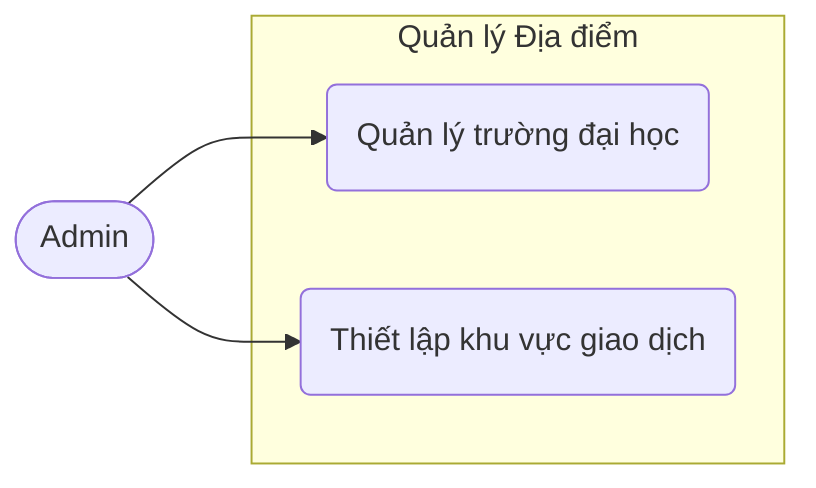
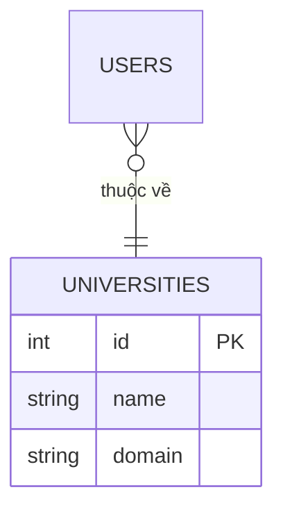

# Sprint 2: Location / Zone Management

## Biểu đồ Use Case

```mermaid
flowchart LR
    Admin([Admin])
    
    subgraph SP2 [Quản lý Địa điểm]
        UC1(Quản lý trường đại học)
        UC2(Thiết lập khu vực giao dịch)
    end
    
    Admin --> UC1
    Admin --> UC2
```

## Biểu đồ Cơ sở dữ liệu (ERD)

```mermaid
erDiagram
    UNIVERSITIES {
        int id PK
        string name
        string domain
    }
    
    USERS }o--|| UNIVERSITIES : "thuộc về"
```
