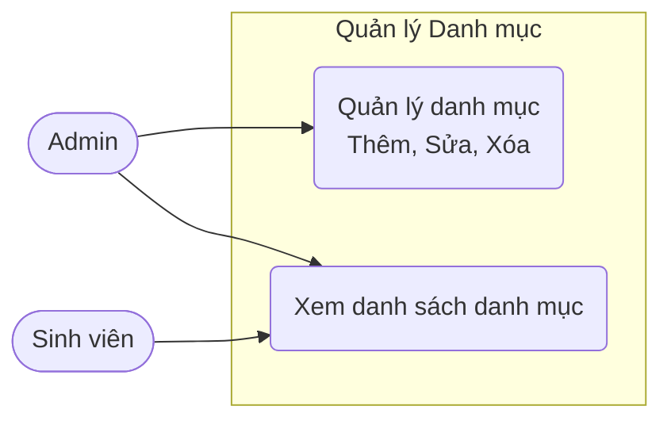
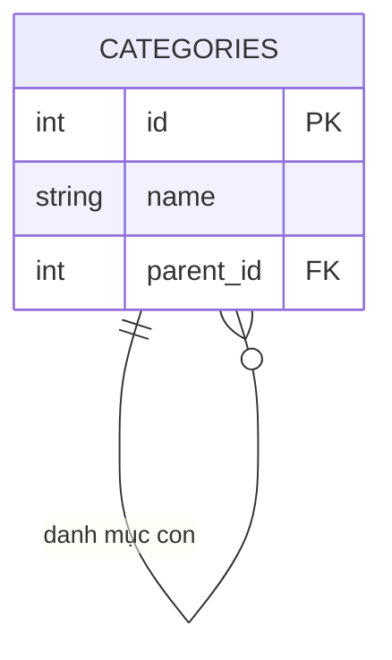

# Sprint 3: Category Management

## Biểu đồ Use Case

```mermaid
flowchart LR
    Admin([Admin])
    Student([Sinh viên])
    
    subgraph SP3 [Quản lý Danh mục]
        UC1(Quản lý danh mục\nThêm, Sửa, Xóa)
        UC2(Xem danh sách danh mục)
    end
    
    Admin --> UC1
    Admin --> UC2
    Student --> UC2
```

## Biểu đồ Cơ sở dữ liệu (ERD)

```mermaid
erDiagram
    CATEGORIES {
        int id PK
        string name
        int parent_id FK
    }
    
    CATEGORIES ||--o{ CATEGORIES : "danh mục con"
```
