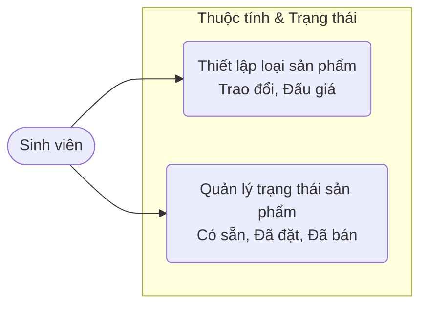
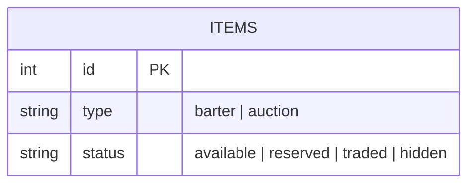

# Sprint 4: Attributes & Tags

## Biểu đồ Use Case

```mermaid
flowchart LR
    Student([Sinh viên])
    
    subgraph SP4 [Thuộc tính & Trạng thái]
        UC1(Thiết lập loại sản phẩm\nTrao đổi, Đấu giá)
        UC2(Quản lý trạng thái sản phẩm\nCó sẵn, Đã đặt, Đã bán)
    end
    
    Student --> UC1
    Student --> UC2
```

## Biểu đồ Cơ sở dữ liệu (ERD)

```mermaid
erDiagram
    ITEMS {
        int id PK
        string type "barter | auction"
        string status "available | reserved | traded | hidden"
    }
```
