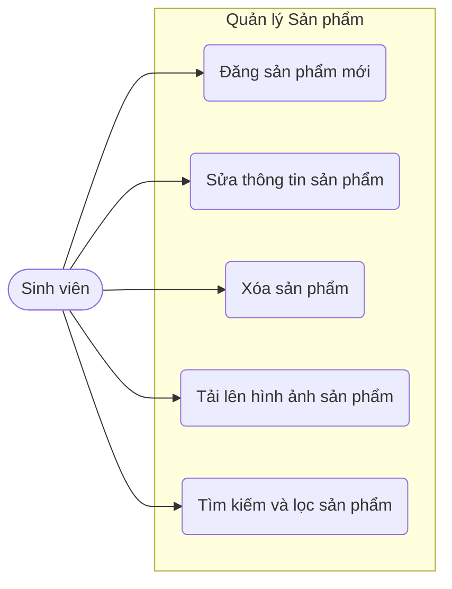
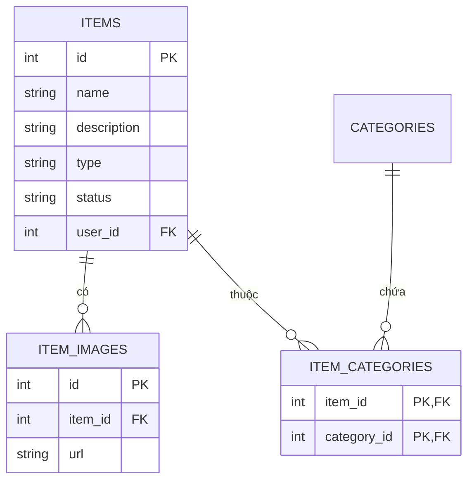

# Sprint 5: Product / Item Management

## Biểu đồ Use Case

```mermaid
flowchart LR
    Student([Sinh viên])
    
    subgraph SP5 [Quản lý Sản phẩm]
        UC1(Đăng sản phẩm mới)
        UC2(Sửa thông tin sản phẩm)
        UC3(Xóa sản phẩm)
        UC4(Tải lên hình ảnh sản phẩm)
        UC5(Tìm kiếm và lọc sản phẩm)
    end
    
    Student --> UC1
    Student --> UC2
    Student --> UC3
    Student --> UC4
    Student --> UC5
```

## Biểu đồ Cơ sở dữ liệu (ERD)

```mermaid
erDiagram
    ITEMS {
        int id PK
        string name
        string description
        string type
        string status
        int user_id FK
    }
    ITEM_IMAGES {
        int id PK
        int item_id FK
        string url
    }
    ITEM_CATEGORIES {
        int item_id PK, FK
        int category_id PK, FK
    }
    
    ITEMS ||--o{ ITEM_IMAGES : "có"
    ITEMS ||--o{ ITEM_CATEGORIES : "thuộc"
    CATEGORIES ||--o{ ITEM_CATEGORIES : "chứa"
```
