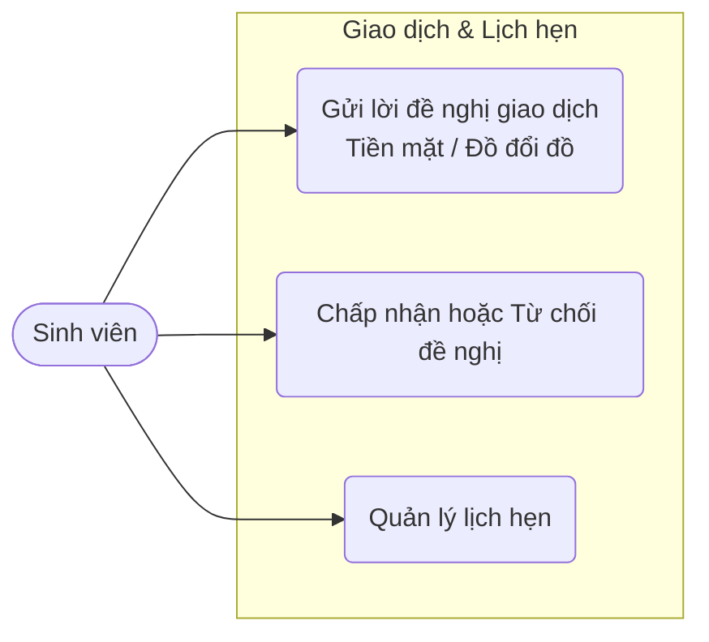
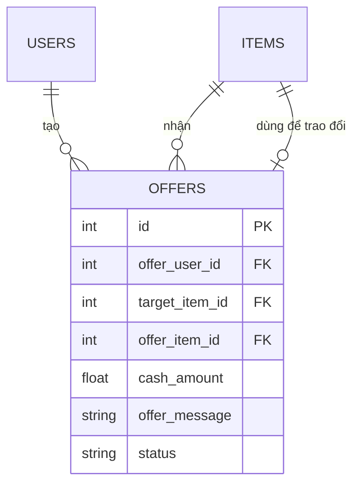

# Sprint 6: Transactions & Appointments

## Biểu đồ Use Case

```mermaid
flowchart LR
    Student([Sinh viên])
    
    subgraph SP6 [Giao dịch & Lịch hẹn]
        UC1(Gửi lời đề nghị giao dịch\nTiền mặt / Đồ đổi đồ)
        UC2(Chấp nhận hoặc Từ chối đề nghị)
        UC3(Quản lý lịch hẹn)
    end
    
    Student --> UC1
    Student --> UC2
    Student --> UC3
```

## Biểu đồ Cơ sở dữ liệu (ERD)

```mermaid
erDiagram
    OFFERS {
        int id PK
        int offer_user_id FK
        int target_item_id FK
        int offer_item_id FK
        float cash_amount
        string offer_message
        string status
    }
    
    USERS ||--o{ OFFERS : "tạo"
    ITEMS ||--o{ OFFERS : "nhận"
    ITEMS ||--o| OFFERS : "dùng để trao đổi"
```
