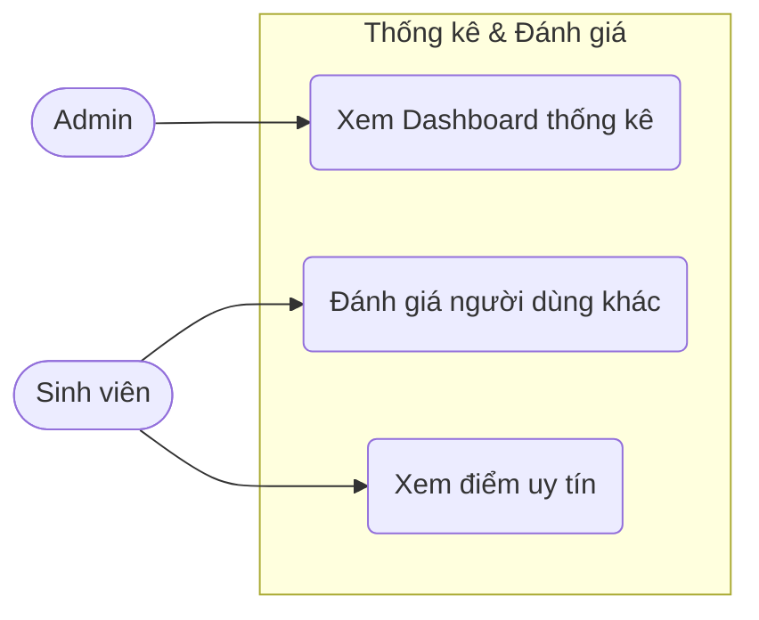
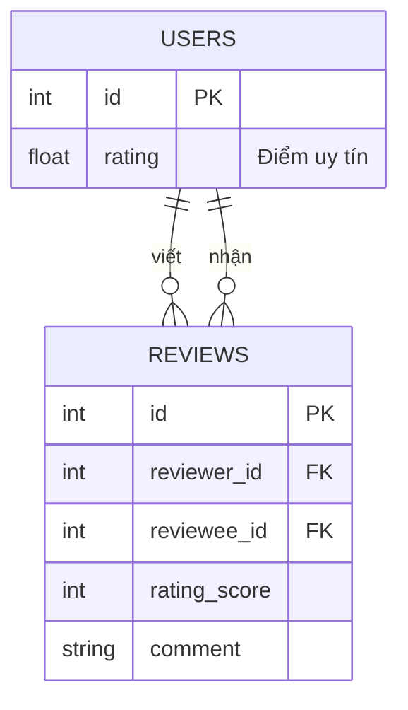

# Sprint 7: Statistics & Rating

## Biểu đồ Use Case

```mermaid
flowchart LR
    Admin([Admin])
    Student([Sinh viên])
    
    subgraph SP7 [Thống kê & Đánh giá]
        UC1(Xem Dashboard thống kê)
        UC2(Đánh giá người dùng khác)
        UC3(Xem điểm uy tín)
    end
    
    Admin --> UC1
    Student --> UC2
    Student --> UC3
```

## Biểu đồ Cơ sở dữ liệu (ERD)

*(Các bảng liên quan đến điểm đánh giá và lịch sử giao dịch)*

```mermaid
erDiagram
    USERS {
        int id PK
        float rating "Điểm uy tín"
    }
    
    REVIEWS {
        int id PK
        int reviewer_id FK
        int reviewee_id FK
        int rating_score
        string comment
    }
    
    USERS ||--o{ REVIEWS : "viết"
    USERS ||--o{ REVIEWS : "nhận"
```
