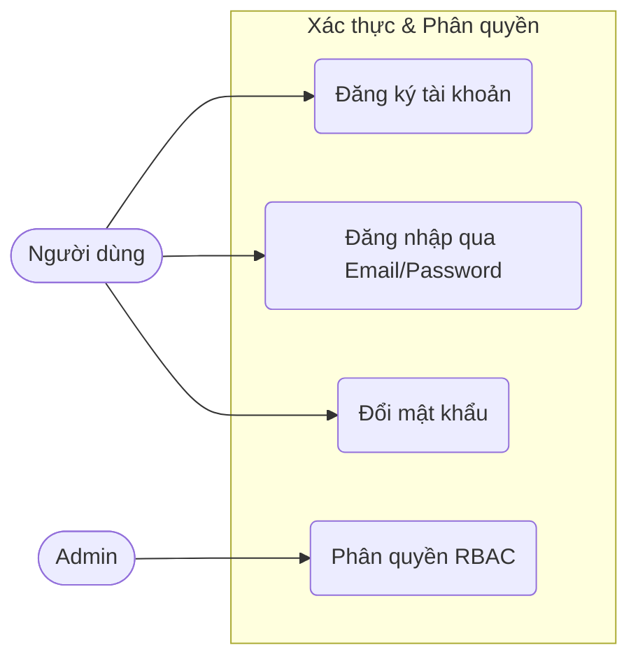
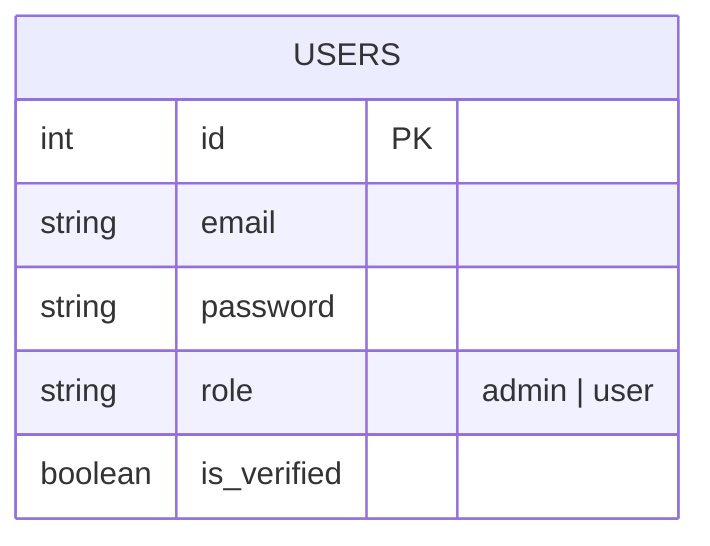

# Sprint 8: Auth & Authorization

## Biểu đồ Use Case

```mermaid
flowchart LR
    User([Người dùng])
    Admin([Admin])
    
    subgraph SP8 [Xác thực & Phân quyền]
        UC1(Đăng ký tài khoản)
        UC2(Đăng nhập qua Email/Password)
        UC3(Đổi mật khẩu)
        UC4(Phân quyền RBAC)
    end
    
    User --> UC1
    User --> UC2
    User --> UC3
    Admin --> UC4
```

## Biểu đồ Cơ sở dữ liệu (ERD)

```mermaid
erDiagram
    USERS {
        int id PK
        string email
        string password
        string role "admin | user"
        boolean is_verified
    }
```
