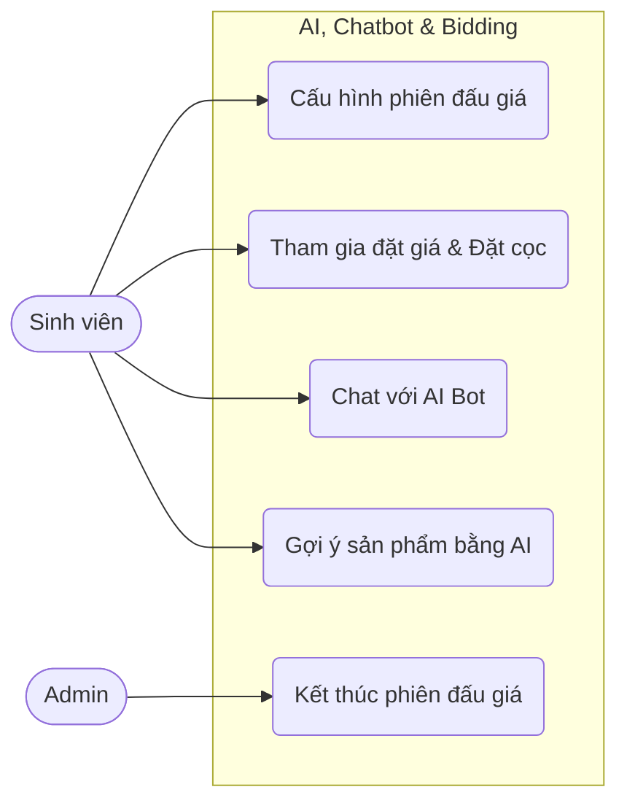
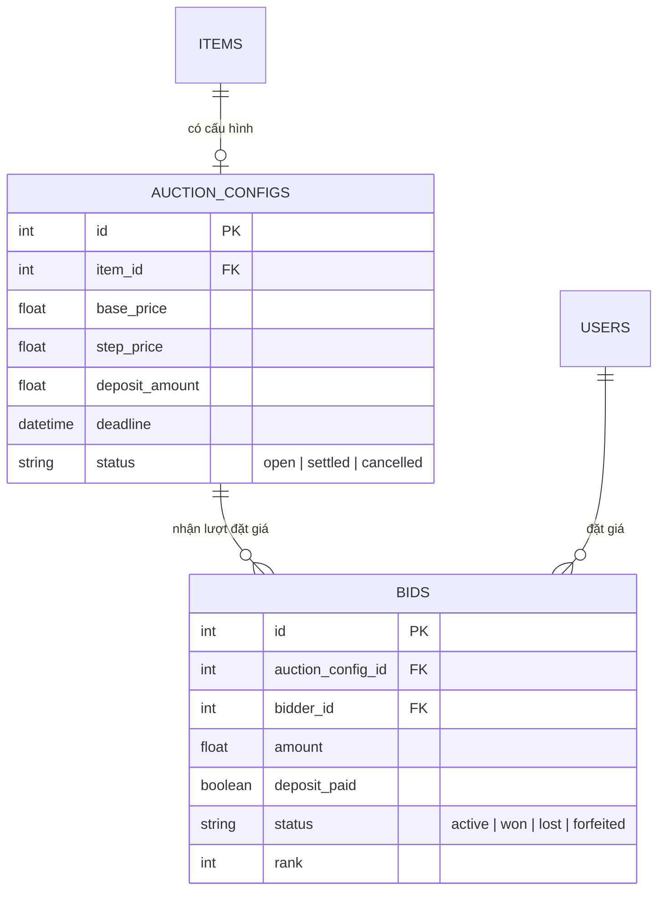

# Sprint 9: AI, Chatbot & Bidding / Auction

## Biểu đồ Use Case

```mermaid
flowchart LR
    Student([Sinh viên])
    Admin([Admin])
    
    subgraph SP9 [AI, Chatbot & Bidding]
        UC1(Cấu hình phiên đấu giá)
        UC2(Tham gia đặt giá & Đặt cọc)
        UC3(Kết thúc phiên đấu giá)
        UC4(Chat với AI Bot)
        UC5(Gợi ý sản phẩm bằng AI)
    end
    
    Student --> UC1
    Student --> UC2
    Student --> UC4
    Student --> UC5
    Admin --> UC3
```

## Biểu đồ Cơ sở dữ liệu (ERD)

```mermaid
erDiagram
    AUCTION_CONFIGS {
        int id PK
        int item_id FK
        float base_price
        float step_price
        float deposit_amount
        datetime deadline
        string status "open | settled | cancelled"
    }
    
    BIDS {
        int id PK
        int auction_config_id FK
        int bidder_id FK
        float amount
        boolean deposit_paid
        string status "active | won | lost | forfeited"
        int rank
    }
    
    ITEMS ||--o| AUCTION_CONFIGS : "có cấu hình"
    AUCTION_CONFIGS ||--o{ BIDS : "nhận lượt đặt giá"
    USERS ||--o{ BIDS : "đặt giá"
```
